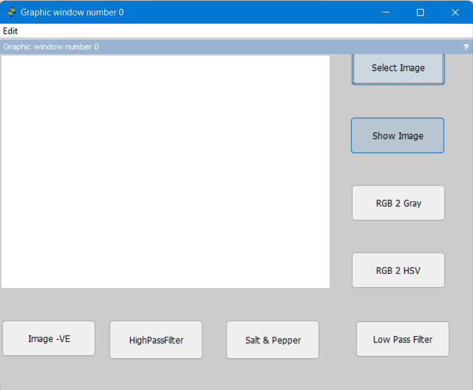
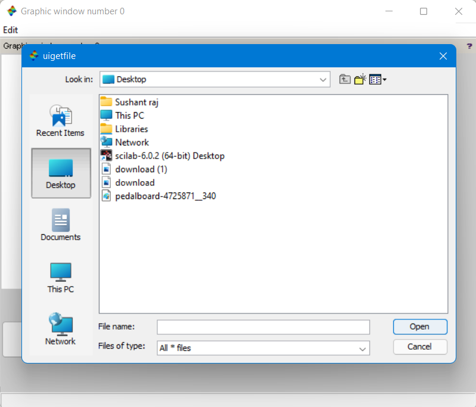
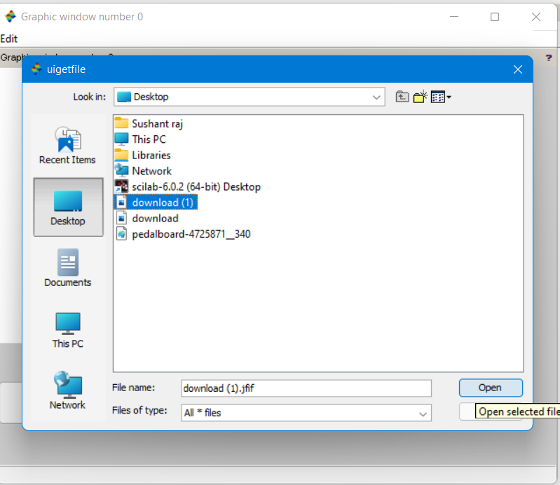
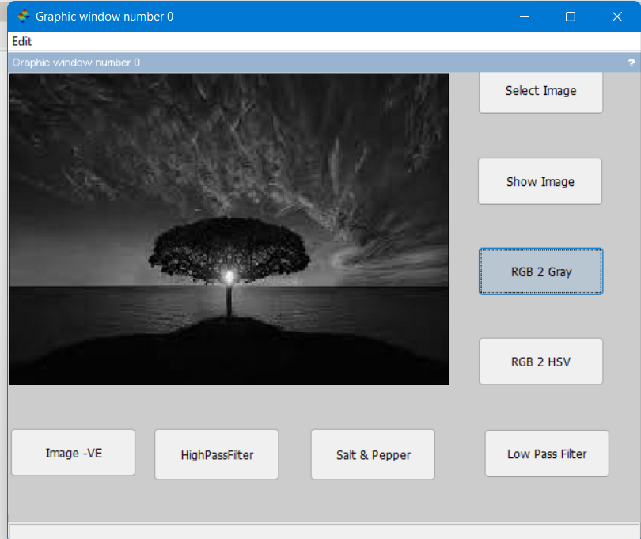
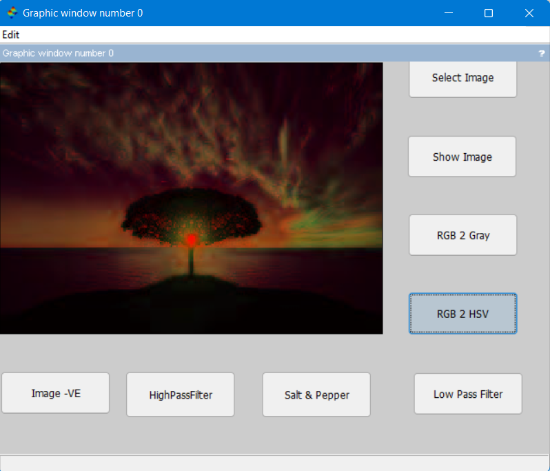
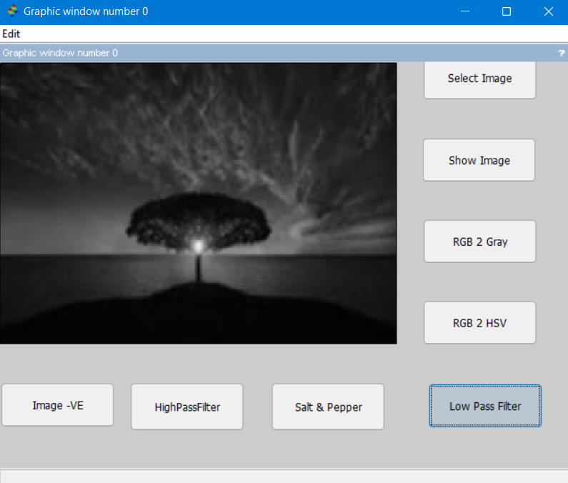
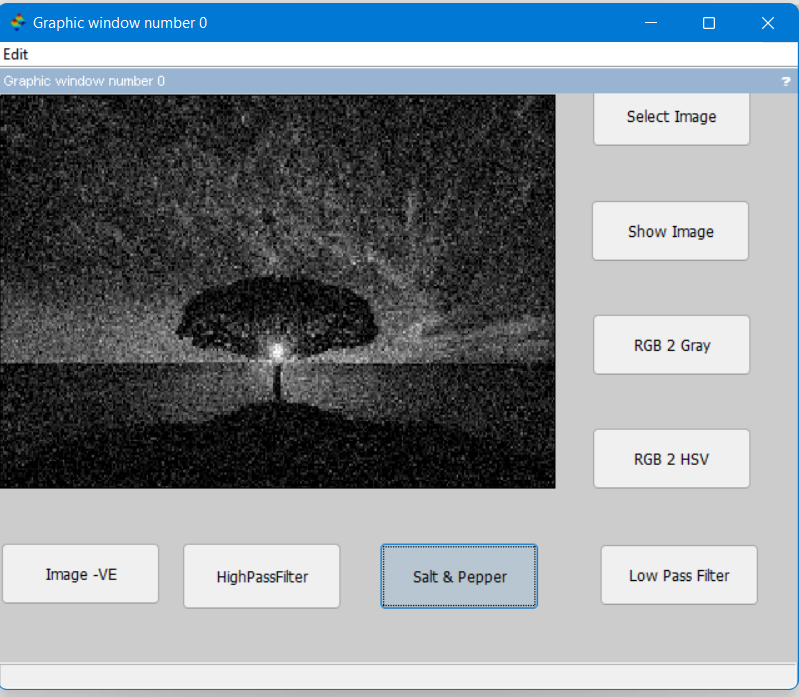
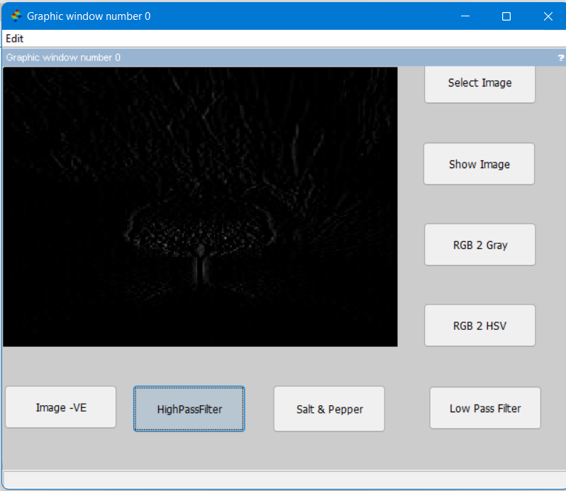
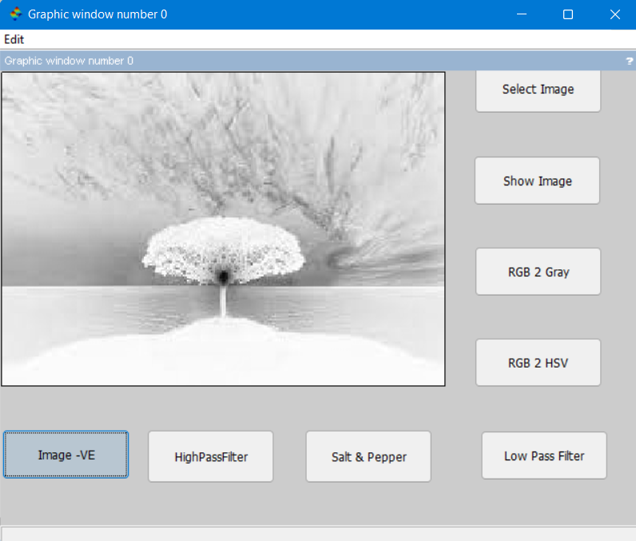

# image_processing_scilab

This a simple image processing app in scilab.
Uses scilab prebuild modules. 
You can simply this add this file to your scilab directory and execute it.

<h2>IMPORTANT<h2> (ATOMS MODULE : Scilab Image Processing Modeule) is needed.

